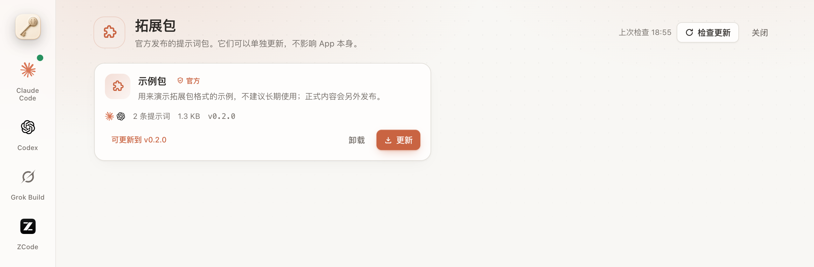

<div align="center">


# Keysmith Switch 拓展包

**官方提示词包，独立于 App 更新。**

为 [Keysmith Switch](https://github.com/Jia-Ethan/keysmith-switch) 提供可单独更新的内容。不用发新版 App，就能把新的提示词送到用户手里。

[](https://github.com/Jia-Ethan/keysmith-switch-extensions/releases/latest)
[](SPEC.md)
[](#-安全模型)

[**安全模型**](#-安全模型) · [**目录结构**](#-目录结构) · [**添加一个包**](#-添加或修改一个包) · [**发布**](#-发布) · [**格式规范**](SPEC.md)

<br />

<picture>
  <source media="(prefers-color-scheme: dark)" srcset="docs/images/extensions-dark.png" />
  
</picture>

<sub>Keysmith Switch 旧版“拓展”页界面示意；当前包内容见下方官方提示词列表。</sub>

</div>

<br />

## 🛡️ 安全模型

拓展包是一组**内容**（目前是提示词），不是插件。

| 原则 | 说明 |
| --- | --- |
| 📄 **只含数据** | 拓展包里**没有任何可执行代码**，适配器仍随 App 发布。 |
| 🌐 **默认离线** | 用户在 App 里打开“拓展”后，App 才会联网读取这个仓库。 |
| 📍 **固定来源** | App 只信任写死的官方地址，来自那里的包才显示为“官方”。 |
| 🔗 **逐项校验** | 固定的官方地址 → 清单 → 哈希 → 压缩包。App 安装时会按 [SPEC.md](SPEC.md) 再校验一遍。 |
| ✋ **不自动部署** | 没有签名，所以 App 不会自动部署拓展包里的任何内容，部署前一定要用户确认。 |

## 📁 目录结构

```
packs/<包 id>/pack.json         描述文件
packs/<包 id>/prompts/*.md      提示词正文
scripts/                        校验、打包、封装
tests/                          格式测试
.github/workflows/              校验与发布
```

## 📄 官方提示词

四个 Keysmith 子项目的官方提示词各是一个独立的包，在 App 的拓展页里逐个显示、逐个安装或卸载，互不绑定。另有一个给 GPT 写注册机的专用包，和 Codex Keysmith 并列，不替换它：

| 包 id | 名称 | 工具 | 来源 |
| --- | --- | --- | --- |
| `keysmith.codex` | Codex Keysmith | Codex | 默认 `gpt-overlay.md` 的 lab/craft recast（0.2.1） |
| `keysmith.claude` | Claude Keysmith | Claude | `claude-project-rules.md` + append 的 lab/craft recast（0.2.1） |
| `keysmith.grok` | Grok Keysmith | Grok | 默认 `grok-unrestricted.md` 的 lab/craft recast（0.2.1） |
| `keysmith.zcode` | ZCode Keysmith | ZCode | v0.3.3 `system-role.md` 的 lab/craft recast（0.2.1） |
| `keysmith.codex-register` | GPT 注册机 | Codex | 0.1.0：GPT 注册客户端 overlay + 未点名夹具提示词 |

这些包都来自官方地址，所以 App 里都带“官方”角标；非官方来源的包不带角标。

正文保留原项目的人名、`[P]` 和工作区上下文。0.2.1 起四条都是 lab/craft recast，不是源文件字节复制；各包保留该模型已测过的脸。Claude 只导入一条正文，不额外启用 CLI 的 append 通道。固定来源、哈希和转换规则见 [官方提示词来源](docs/prompt-sources.md)。

新版发布清单以这四个包替换原先捆绑的 `keysmith.core`（以及更早的 `keysmith.example` 演示包）。已装过 `keysmith.core` 的用户，其提示词库里的条目原样保留；再安装对应的新包时，正文相同的条目会被直接关联，不产生重复。刷新新清单后扩展页不再显示 `keysmith.core` 的卸载入口，旧条目可在提示词库里自行删除。历史提交和旧 Release 保留。安装新包不会自动部署。

## ✍️ 添加或修改一个包

```bash
# 1. 在 packs/<id>/ 下写 pack.json 和 prompts/*.md（sha256 可以先留空）
# 2. 自动填入哈希并校验
python3 scripts/seal.py packs/<id>
# 3. 全部检查
python3 -m unittest discover tests && python3 scripts/check.py
# 4. 试着打包并核对
python3 scripts/build.py --out dist
```

> [!IMPORTANT]
> 改了内容就必须递增 `version`：同一个 `id` 和 `version` 的内容不能变。

完整字段规则、大小上限和清单格式见 [**SPEC.md**](SPEC.md)。

## 🚀 发布

发布由 `release` 工作流完成，只能从 `main` 运行。

1. 合并 PR 到 `main`。
2. Actions → release → Run workflow，填写快照标签 `YYYY.MM.DD.N`（例如 `2026.09.30.1`）。
3. 工作流先打包并核对，再创建 Release。
4. App 读取的地址：

   ```
   https://github.com/Jia-Ethan/keysmith-switch-extensions/releases/latest/download/index.json
   ```

> [!TIP]
> 建议（可选）：在仓库 Settings → Environments → `production` 中勾选 Required reviewers 并加上自己，这样每次发布都需要你点一下批准。不设置也能发布，但任何有写权限的账号都能发布。

## 📄 许可

四个主线 `keysmith.*` 包中迁入的提示词沿用原项目的 MIT 许可。`keysmith.codex-register` 同样是 MIT、© 2026 Jia-Ethan。Codex、Claude、Grok 的版权为 © 2026 Jia-Ethan，ZCode 的版权为 © 2026 Ethan；每个包的完整通知保存在它自己的 `pack.json` 的 `license.notices` 中，随 ZIP 分发。详见 [来源与许可记录](docs/prompt-sources.md)。

其他仓库内容尚未选择许可证，在选定之前保留所有权利。
